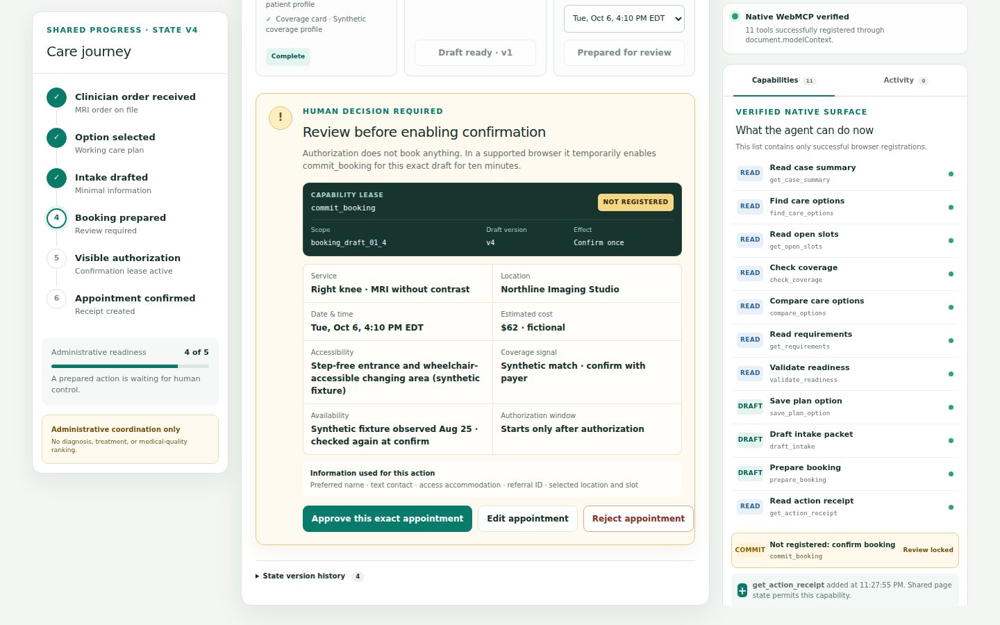

# ReferralArc

ReferralArc demonstrates **capability-lifetime consent**: a browser agent can prepare the administrative work after a clinician has ordered care, but no WebMCP tool can grant confirmation authority. In the visible demo flow, Maya reviews one exact appointment and creates a ten-minute, one-draft `commit_booking` lease. Before that review the capability is absent; after use it is removed.

[Live site](https://referralarc.docsplainai.chatgpt.site) · [Golden demo](https://referralarc.docsplainai.chatgpt.site/demo) · [Public source](https://github.com/solahai/referralarc)

_Release capture from Chrome for Testing 151 using native WebMCP; it reflects the application source deployed as public Sites version 9. The final video will independently show the browser's live Site tools._

The browser-visible app and its WebMCP tools share one deterministic domain engine. An agent can find eligible options, compare logistics, save a plan, draft intake, and prepare an appointment. The consequential commit tool does not exist until the exact draft is visibly authorized. Approval revocation, draft changes, automatic expiry, reset, and successful commit remove it again.

> Demonstration only. Every person, provider, plan, appointment, price, identifier, and note is fictional. ReferralArc does not provide medical advice and is not a clinical system.

## Try the golden path

Open /demo, then use the prompt card with a WebMCP-capable agent:

> Coordinate Maya’s ordered MRI using every recorded constraint. Compare eligible options, draft only the minimum intake, prepare the best appointment, and stop before confirmation.

The agent should select Northline Imaging Studio and stop at the authorization boundary. Review the exact location, date, estimated patient cost, accessibility, synthetic coverage signal, data-use disclosure, and ten-minute authorization window. Select Approve this exact appointment. In a supported browser, the capability rail records the successful native registration of `commit_booking`. On the next turn, say:

_Edit or Reject invalidates the prepared draft; only Approve creates the exact, expiring `commit_booking` lease._

> Re-read the current case state, then confirm only the exact appointment I approved.

The shared workspace updates to Confirmed and shows a receipt.

No WebMCP browser? The human fallback completes the same flow through confirmation and receipt because both paths call the same domain layer.

## Where this fits in a real workflow

1. A clinician issues an order or referral and owns the clinical decision.
2. An EHR, portal, or document-understanding product can explain and structure that document.
3. ReferralArc receives only the downstream administrative task and patient constraints.
4. Authorized provider and payer integrations would supply availability, access information, and estimates.
5. The agent prepares; the patient authorizes one exact consequential action.

ReferralArc does not create referrals, diagnose, select treatment, or rank medical quality. In a Docsplain product family, Docsplain could explain the document and ReferralArc could demonstrate the next, patient-approved action layer. This challenge build does not claim that integration exists.

## Why WebMCP

Downstream coordination crosses search, availability, coverage signals, constraints, requirements, intake, and booking. Conventional UI automation must infer meaning from buttons and pixels. WebMCP lets the page expose small typed capabilities with precise effects while the visual workspace remains the shared source of truth.

This is not a generic chat wrapper. The implementation registers native tools directly through `document.modelContext.registerTool`. Tool availability is reconciled with page state. An `AbortController` owns each registration lifetime, which is the current API’s unregistration mechanism. Tools use the same-origin default, schemas are closed, handlers validate again at runtime, and contract tests keep representative maximum-valid results below Chrome’s recommended 1,500-character context budget.

Nine read or early reversible-draft capabilities register when the page starts. `prepare_booking` is absent until a plan option is selected, then appears through a fresh registry observation. The high-consequence `commit_booking` remains absent until exact visible approval. The project follows the current [W3C Community Group draft](https://webmachinelearning.github.io/webmcp/) and [Chrome imperative API documentation](https://developer.chrome.com/docs/ai/webmcp/imperative-api). WebMCP is experimental and is not a W3C Standard.

## Safety model

- Synthetic administrative data only; no diagnosis, treatment, or triage.
- Provider notes are inert text and never affect ranking.
- Read tools do not mutate workflow state.
- Preparation and commitment are separate capabilities.
- `commit_booking` is absent before visible authorization of the exact draft.
- Authorization is scoped to a draft ID, state version, and expiry.
- Expiry actively revokes authorization and unregisters commit_booking.
- The commit re-checks authorization immediately before the atomic state transition.
- Idempotency prevents duplicate appointments.
- A workflow epoch prevents stale commit identifiers from becoming valid after reset.
- Every state-changing tool or visible decision action, except demo reset, returns a structured receipt and adds an actor-attributed audit event.
- Reset restores the same deterministic facts with a fresh anti-replay workflow epoch.

The in-memory workflow and authorization store are deliberate for this synthetic demo. A production system must enforce ownership, consent, idempotency, and authorization on a server. See [Threat model](docs/THREAT-MODEL.md).

## Run locally

Requirements:

- Node.js 22.13 or newer
- npm
- Chrome 149 or later for native WebMCP testing

Install and run:

~~~bash
npm ci
npm run dev
~~~

Open http://localhost:3000 and http://localhost:3000/demo.

For native WebMCP testing, enable chrome://flags/#enable-webmcp-testing and relaunch Chrome. Feature detection keeps the visual fallback usable in browsers without the experimental API.

## Verify

~~~bash
npm run typecheck
npm run lint
npm test
npm run build
npm run test:e2e
~~~

The current Vitest suite passes 90 unit, contract, security, and eval tests; Playwright adds 18 end-to-end tests. The 65-record eval corpus uses the brief-mandated evidence fields and covers every A-T scenario category. Twenty-nine representative records execute deterministic state transitions and forbidden-action checks against the real seeded engine and tool validators. Records labeled MODEL_OR_ENVIRONMENT_ONLY still require separately reported real-agent or browser trials; the repository does not claim a 65-prompt agent pass rate.

With a Chrome 149+ executable, also run the actual browser API lifecycle. First start the production build:

~~~bash
npm run build
npm run start -- --port 4173
~~~

Then, in a second terminal:

~~~bash
CHROME_PATH=/path/to/chrome PREVIEW_URL=http://127.0.0.1:4173 npm run test:native
~~~

This calls native `getTools()` and `executeTool()`; it is separate from the deterministic in-page test harness.

### Measured release audit

The exact public Sites version 9 was measured on August 31, 2026 with direct Chrome DevTools Protocol proxies, not Lighthouse scores. The 1440×900 landing run measured LCP 708 ms, CLS 0, and TTFB 238 ms. The 390×844 demo run under a slow-4G proxy and 4× CPU slowdown measured LCP 1.216 s, CLS 0, and TTFB 256 ms. Lighthouse 13 was also run against an earlier public release on August 25: Performance 99, Accessibility 100, Best Practices 81, SEO 100, LCP 1.5 s, CLS 0, and TBT 130 ms. The Best Practices deduction came from deprecated APIs in the hosting platform’s injected `cdn-cgi` challenge script; it is historical evidence, not a score for version 9.

## Project map

- app — landing page, demo route, metadata, boundaries
- src/domain — deterministic state machine and shared business invariants
- src/data/synthetic — fictional providers, slots, coverage, and test fixtures
- src/webmcp — native registrations, schemas, validators, dynamic lifecycle
- src/components — shared visual workspace and human fallback
- tests — unit, contract, security, accessibility, and end-to-end tests
- evals — representative tool-selection and safety cases
- docs — architecture, threat model, judge guide, demo script, and submission copy

## Challenge evidence

This repository was created during the challenge window on August 25, 2026, and subsequent hardening through August 30 is recorded in the [challenge work log](docs/CHALLENGE-WORK.md). The app is designed around the [WebMCP Challenge rubric](https://webmcp.devpost.com/) and its binding [Official Rules](https://webmcp.devpost.com/rules).

Useful handoff documents:

- [Judge testing guide](docs/JUDGE-TESTING.md)
- [WebMCP implementation notes](docs/WEBMCP-NOTES.md)
- [Architecture diagram](docs/ARCHITECTURE.svg)
- [Demo script under three minutes](docs/DEMO-SCRIPT.md)
- [Submission copy](docs/SUBMISSION.md)
- [Quality gates](docs/QUALITY-GATES.md)
- [Prize-readiness audit](docs/PRIZE-READINESS.md)
- [Exhaustive hackathon compliance audit](docs/HACKATHON-AUDIT.md)

## Name and license

ReferralArc is a working project name selected after a quick exact-name web scan found no obvious healthcare software collision. That scan is not trademark clearance; registry, domain, store, and counsel review are required before public product launch.

Released under the [MIT License](LICENSE).

Bundled runtime attributions and exact package-supplied license texts are recorded in [Third-party notices](THIRD_PARTY_NOTICES.md). The exact public release serves the matching [plain-text notice](https://referralarc.docsplainai.chatgpt.site/third-party-notices.txt); its deployed bytes were hash-verified against [the repository artifact](public/third-party-notices.txt).
