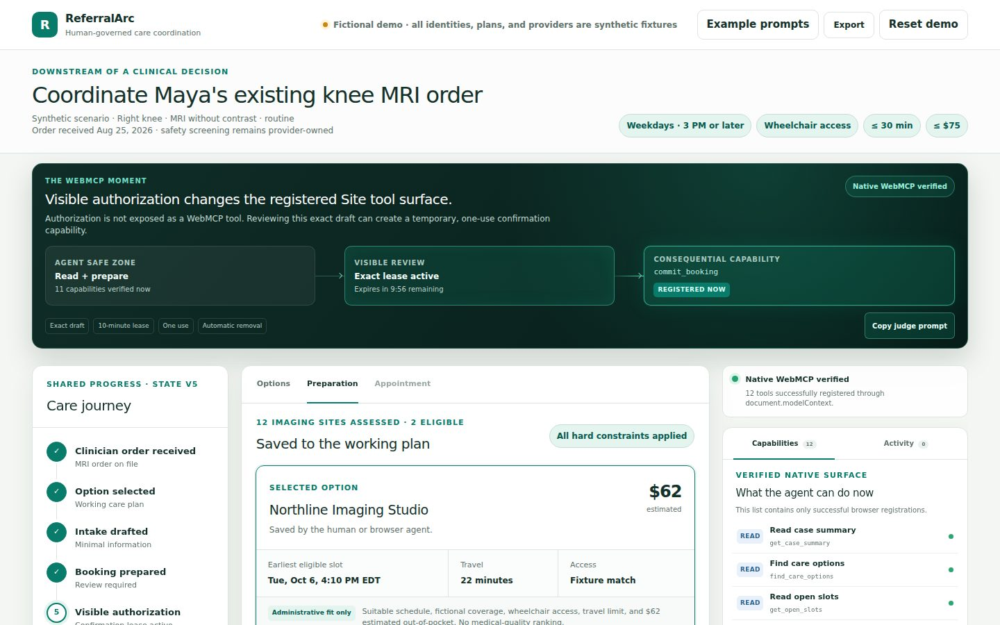

# ReferralArc

ReferralArc is a human-governed agentic workspace for administrative healthcare coordination. It demonstrates how a person and a browser agent can move one synthetic MRI referral from ready to confirmed without giving the agent unchecked authority.

[Live site](https://referralarc.docsplainai.chatgpt.site) · [Golden demo](https://referralarc.docsplainai.chatgpt.site/demo) · [Public source](https://github.com/solahai/referralarc)

The browser-visible app and its WebMCP tools share one deterministic domain engine. An agent can find eligible options, compare logistics, save a plan, draft intake, and prepare an appointment. The consequential commit tool does not exist until a person approves the exact draft. Approval revocation, draft changes, expiry, reset, and successful commit remove it again.

> Demonstration only. Every person, provider, plan, appointment, price, identifier, and note is fictional. ReferralArc does not provide medical advice and is not a clinical system.

## Try the golden path

Open /demo, then use the prompt card with a WebMCP-capable agent:

> Coordinate Maya’s MRI referral. Compare only options that are wheelchair accessible, covered by the fictional plan, within 30 minutes, cost no more than $75, and offer a weekday slot after 3 PM. Prepare the best option, but do not confirm it.

The agent should select Northline Imaging and stop at the approval boundary. Review the exact location, date, estimated patient cost, accessibility, coverage, and data-use disclosure. Select Approve this exact booking. The native capability rail then adds commit_booking. On the next turn, say:

> Go ahead and confirm the approved appointment.

The shared workspace updates to Confirmed and shows a receipt.

No WebMCP browser? Use the same actions in the human fallback interface. The result is identical because both paths call the same domain layer.

## Why WebMCP

Referral coordination crosses search, availability, coverage, constraints, intake, and booking. Conventional UI automation must infer meaning from buttons and pixels. WebMCP lets the page expose small, typed, state-aware capabilities with precise effects while the visual workspace remains the shared source of truth.

This is not a generic chat wrapper. The implementation registers native tools directly through document.modelContext.registerTool. Tool availability is reconciled with page state. An AbortController owns each registration lifetime, which is the current API’s unregistration mechanism. Tools are same-origin by default, schemas are closed, handlers validate again at runtime, and all results stay below the recommended 1,500-character context budget.

The project follows the current [W3C Community Group draft](https://webmachinelearning.github.io/webmcp/) and [Chrome imperative API documentation](https://developer.chrome.com/docs/ai/webmcp/imperative-api). WebMCP is experimental and is not a W3C Standard.

## Safety model

- Synthetic administrative data only; no diagnosis, treatment, or triage.
- Provider notes are inert text and never affect ranking.
- Read tools do not mutate workflow state.
- Preparation and commitment are separate capabilities.
- commit_booking is absent before exact human approval.
- Approval is scoped to a draft ID, state version, and expiry.
- The commit re-checks authorization immediately before the atomic state transition.
- Idempotency prevents duplicate appointments.
- Every successful write returns a structured receipt and adds an audit event.
- Reset restores the deterministic initial state.

The in-memory approval store is deliberate for this synthetic demo. A production system must enforce ownership, approval, idempotency, and authorization on a server. See [Threat model](docs/THREAT-MODEL.md).

## Run locally

Requirements:

- Node.js 24
- npm
- Chrome 149 or later for native WebMCP testing

Install and run:

~~~bash
npm install
npm run dev
~~~

Open http://localhost:3000 and http://localhost:3000/demo.

For native WebMCP testing, enable chrome://flags/#enable-webmcp-testing and relaunch Chrome. Feature detection keeps the visual fallback usable in browsers without the experimental API.

## Verify

~~~bash
npm run typecheck
npm run lint
npm test
npm run build
npm run test:e2e
~~~

The suite covers deterministic ranking, mutation boundaries, stale-state rejection, exact approval, cancellation, idempotency, dynamic registration, metadata budgets, hostile input, prompt-injection fixtures, accessibility, mobile overflow, and the complete agent/human golden path.

### Measured release audit

Lighthouse 13 was run against the public production URL with its default mobile throttling on August 25, 2026: Performance 99, Accessibility 100, Best Practices 81, SEO 100, LCP 1.5 s, CLS 0, and TBT 130 ms. The Best Practices deduction is attributable to three deprecated APIs in the hosting platform’s injected cdn-cgi challenge script; the app’s console-error audit passes and the same app build scores 96 for Best Practices locally. The pre-deployment local audit measured Performance 88, Accessibility 100, Best Practices 96, and SEO 100.

## Project map

- app — landing page, demo route, metadata, boundaries
- src/domain — deterministic state machine and shared business invariants
- src/data/synthetic — fictional providers, slots, coverage, and test fixtures
- src/webmcp — native registrations, schemas, validators, dynamic lifecycle
- src/components — shared visual workspace and human fallback
- tests — unit, contract, security, accessibility, and end-to-end tests
- evals — representative tool-selection and safety cases
- docs — architecture, threat model, judge guide, demo script, and submission copy

## Challenge evidence

All implementation in this repository was created during the challenge window on August 25, 2026. [Challenge work log](docs/CHALLENGE-WORK.md) distinguishes the new work. The app is designed around the [WebMCP Challenge rubric](https://webmcp.devpost.com/) and its binding [Official Rules](https://webmcp.devpost.com/rules).

Useful handoff documents:

- [Judge testing guide](docs/JUDGE-TESTING.md)
- [WebMCP implementation notes](docs/WEBMCP-NOTES.md)
- [Architecture diagram](docs/ARCHITECTURE.svg)
- [Demo script under three minutes](docs/DEMO-SCRIPT.md)
- [Submission copy](docs/SUBMISSION.md)
- [Quality gates](docs/QUALITY-GATES.md)

## Name and license

ReferralArc is a working project name selected after a quick exact-name web scan found no obvious healthcare software collision. That scan is not trademark clearance; registry, domain, store, and counsel review are required before public product launch.

Released under the [MIT License](LICENSE).
